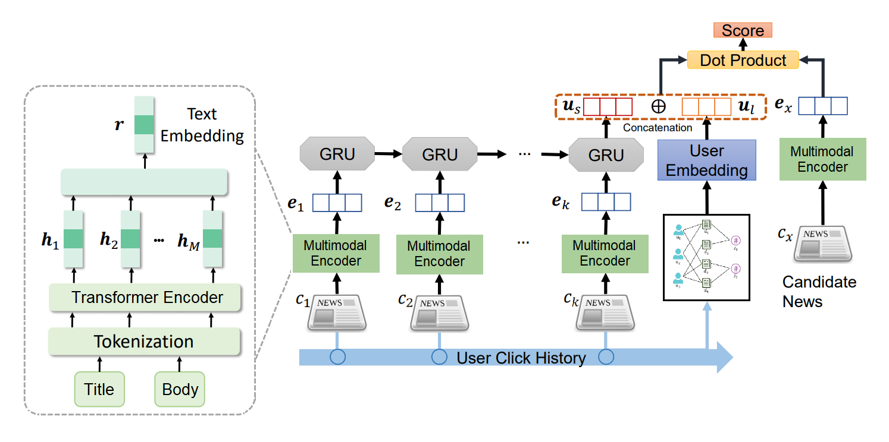

# News Recommendation System Based On Long And Short Term Representation

## Introduction

Recommender system are a essential today in most services. Indeed, their objective is to make recommendation for customers based on their most liked or bought item to increase the probability of them buying more items. Thus, a good recommender system can make the difference for any type of goal. In this manner, the project presented here aims at proposing a recommender system for news article using the [MIND dataset](https://msnews.github.io/). The final model will combine long and short term representation of the interests of a user in order to better capture the whole behavior of a user and make more precise recommendation.

## Model

The model is represented in the following image.

As described previously, its purpose is to make news recommendations by spotting deep understanding of a user based on its clicked history. In this manner, the model is divided in two main parts that can be seen in the two Jupyter Notebooks in the repository: a [long term analysis](pyg-long-term-interests.ipynb) and a [short term analysis](tf-short-term-interests.ipynb). The idea is to dive into each one and explain its advantage to the whole recommendation.

## Long Term

The most common recommendation is made by using the whole history of interacted items by a user and try to predict the next one. There exist various ways to do this but given the situation, the one that was chosen is collaborative filtering through graph analysis. This analysis uses the interaction of users between items to obtain a deeper sense of the interests of one user and make recommendation by crossing the history of all the users. To do so, the model that was used is based on Graph Neural Networks (GNN) that are a new and interesting analysis. The library used is [Pytorch Geometric](https://www.pyg.org/) based on PyTorch as it is the most efficient and ready-to-use.

The goal of this analysis is to train a GNN to make predictions for the users through the graph. In the process, the model will create embeddings for the users that represent them in the whole graph linking them together by news items and their related topic. It is represented by the black square in the model with the corresponding graph and the user embedding that results.

## Short Term

The long term analysis presented previously could work as a standalone. However, the goal of the project is to bring the recommendation further by enriching the representation of a user. That is why the short term analysis is added. It is based on the idea of recent trends a user could follow that would not be spotted by a long term analysis that takes into account all the interacted items. Indeed, a user could be interested by an article that has a topic very different from the ones among its history. It is only when looking at the article that the subject discussed has a link and is part of a recent trend from the user. Thus, the short term analysis aims at looking for the trends of the most recently clicked article by diving into the text of the article and using Natural Language Processing to spot the subtopics discusssed.

This analysis is made possible by Transformers and more specifically the [DistilRoBERTa model](https://huggingface.co/distilroberta-base) that is able to take in input a full article and return a complex vector. This vector will be used then to observe trends in the most recent clicked news. This is represented by the left part of the model. Indeed, it takes k recently cliked news and perfoms the vectorization of the article. Then, a Gated Recurrent Units (GRU) layer analyzes the sequence of vectors to try and predict the next vector representing the recommendation for the user. Thus, the goal of this short term analysis is to produce a vector representing the article that would be most likely clicked by the user.

## Recommendation

In the end, the model has the following: a vector representing the user embedding based on all the interactions of every user and giving the sense of what the user will like and a vector that represents the best article to recommend to the user based on its recent interests. The last part consists in combining the two vectors to produce a complete representation of the user both in long and short term interests. The final part of the model is only about comparing this vector to the candidate news that could be proposed to the user. The final score gives the probability that a given user will click on the article and the model proposes the highest one.
